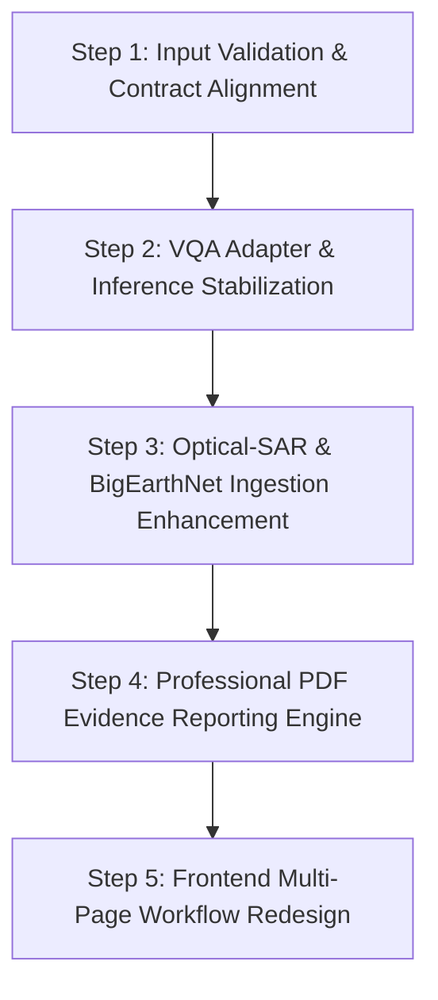

# SatQuery AI — Phase 1: Input & Model Pipeline Audit Report

**Date:** September 3, 2026  
**Auditor:** Antigravity AI  
**Project:** SatQuery AI (SIH26167 — ISRO / SAC)  
**Status:** Audit Complete — Phase 1 (No architecture modifications made)

---

## Executive Summary

This audit evaluates the end-to-end data flow, model pipelines, input contracts, and evidence-reporting mechanisms across SatQuery AI. The audit covers the frontend upload layer, FastAPI route contracts, preprocessing pipelines, model loading/inference routines, LangGraph agent orchestration, and PDF generation.

---

## 1. Current Upload Formats & Ingestion Contracts

### 1.1 Frontend Upload Components (`frontend/src/App.jsx`)
* **Current UI Representation:** The UI provides two generic file pickers:
  1. `"Primary image"` (Mandatory for single-image and paired workflows)
  2. `"Comparison image"` (Marked `OPTIONAL`)
* **Accepted File Extensions:** `accept="image/*,.tif,.tiff"`
* **UI Guidance Deficiencies:**
  * No visual indication or selection for input modality (Sentinel-1 SAR vs. Sentinel-2 Optical vs. Multi-temporal pair vs. Multispectral GeoTIFF).
  * No explanation of band requirements for land-cover classification (12-band Sentinel-2 vs. 3-band RGB).
  * No guidance on polarization channels (VV/VH) for SAR imagery.
  * Uploaded images are passed generically as `file_1` and `file_2` to the `/api/v1/jobs` or `/api/v1/agent` endpoints without client-side metadata inspection.

### 1.2 Frontend API Layer (`frontend/src/api.js`)
* **Transport:** `multipart/form-data` via `fetch()`
* **Payload Structure:**
  * `file_1`: Primary File object
  * `file_2` (optional): Comparison File object
  * `query`: Natural language string (max 240 chars in UI)
  * `include_report`: Boolean flag (`"true"`)
  * `thread_id` (optional): Session tracking UUID

### 1.3 Backend Upload Ingestion (`backend/api/upload.py` & `backend/validation/validator.py`)
* **Persistence:** Files are streamed in 1 MB chunks to `uploads/{uuid4}_{label}{ext}` with a maximum file size limit of 100 MB (`settings.MAX_UPLOAD_BYTES`).
* **Format Whitelist (`InputValidator.SUPPORTED_FORMATS`):** `.tif`, `.tiff`, `.png`, `.jpg`, `.jpeg`
* **Validation Checks:**
  * Total pixel limit: `width * height <= 100,000,000` (`settings.MAX_IMAGE_PIXELS`)
  * Data integrity: NaN / Infinite pixel check using `np.isfinite(sample).all()` for GeoTIFFs read via `rasterio`
  * Fallback to PIL Image reader if `rasterio` is unavailable or for standard PNG/JPEG images.
  * Tag inspection for GeoTIFF ModelPixelScale / ModelTiepoint tags (`tag_v2` keys 33550, 33922).

---

## 2. Current VQA Pipeline Audit

### 2.1 Full Pipeline Trace

$$\text{User Image} \xrightarrow{\text{Upload}} \text{File Persist} \xrightarrow{\text{validate\_image}} \text{load\_rgb\_image} \xrightarrow{\text{PIL RGB}} \text{BlipProcessor} \xrightarrow{\text{Tensor}} \text{PeftModel (BLIP+LoRA)} \xrightarrow{\text{generate}} \text{decode} \xrightarrow{\text{Evidence Guard}} \text{Final Answer}$$

### 2.2 Model Loading & Configuration Parameters
* **Base Model:** `Salesforce/blip-vqa-base` (from Hugging Face cache)
* **Base Architecture:** `transformers.models.blip.modeling_blip.BlipForQuestionAnswering`
* **LoRA Adapter Checkpoint:** `checkpoints/rsvqa-blip-lora`
* **Adapter Configuration (`adapter_config.json`):**
  * PEFT Type: `LORA` (PEFT version 0.20.0)
  * Target Modules: `["query", "value"]`
  * Rank $r = 8$, $\alpha = 16$, $\text{dropout} = 0.05$
  * Bias: `"none"`, `inference_mode: true`
* **Processor:** `BlipProcessor.from_pretrained("checkpoints/rsvqa-blip-lora")`
  * Configured with `local_files_only: true` by default.
  * Includes `tokenizer.json`, `tokenizer_config.json`, `processor_config.json`.
* **Inference Settings:**
  * Evaluation Mode: `model.eval()` explicitly called.
  * Context Manager: `torch.no_grad()` active during inference.
  * Generation Config: `max_new_tokens = 16`, `num_beams = 4`, `do_sample = False`.
  * Device: Automatic selection (`cuda` $\rightarrow$ `mps` $\rightarrow$ `cpu`).

### 2.3 Image Preprocessing & Normalization (`backend/models/vqa/preprocessing.py`)
* `load_rgb_image(image_path)` opens the image with PIL and executes `.convert("RGB")`.
* If image has $> 4$ bands, it throws a `ValueError` rejecting raw multispectral inputs.
* The BLIP processor automatically resizes the image to $384 \times 384$, converts pixel values to $[0.0, 1.0]$, and applies ImageNet normalization:
  * Mean: `[0.48145466, 0.4578275, 0.40821073]`
  * Std: `[0.26862954, 0.26130258, 0.27577711]`

---

## 3. Current BigEarthNet Pipeline Audit

### 3.1 Model Checkpoint & Architecture (`backend/models/land_cover/model.py`)
* **Model ID:** `BIFOLD-BigEarthNetv2-0/convmixer_768_32-all-v0.2.0`
* **Framework:** PyTorch Lightning / ConfigILM (`BigEarthNetv2_0_ImageClassifier` from `reben-training-scripts`)
* **Model Type:** ConvMixer 768/32 (`timm_model_name: "convmixer_768_32"`)
* **Output Nomenclature:** 19 multi-label Corine Land Cover (CLC) Level 2/3 classes.

### 3.2 Expected Input Contract & Band Ordering
* **Expected Bands:** **12 Sentinel-2 Optical Bands** (The checkpoint uses S2 only; "all" refers to 19 classes, not 14 S1+S2 bands).
* **Expected Band Names & ESA Ordering:**
  1. `B01` (60m - Coastal aerosol)
  2. `B02` (10m - Blue)
  3. `B03` (10m - Green)
  4. `B04` (10m - Red)
  5. `B05` (20m - Vegetation Red Edge)
  6. `B06` (20m - Vegetation Red Edge)
  7. `B07` (20m - Vegetation Red Edge)
  8. `B08` (10m - NIR)
  9. `B8A` (20m - Narrow NIR)
  10. `B09` (60m - Water vapour)
  11. `B11` (20m - SWIR)
  12. `B12` (20m - SWIR)
* **Spatial Properties & Resampling:**
  * Raw Sentinel-2 bands have mixed resolutions (10m, 20m, 60m).
  * Input tensor must be resampled and interpolated to a uniform $120 \times 120$ chip via `configilm.extra.BENv2_utils.stack_and_interpolate(..., img_size=120, upsample_mode="nearest")`.
* **Normalization:**
  * Channel-wise z-score normalization using official ConfigILM BENv2 statistics:
    $$\text{Normalized Band}_i = \frac{\text{Band}_i - \text{mean}_{120,\text{nearest}}[i]}{\text{std}_{120,\text{nearest}}[i]}$$
* **Threshold & Multi-Label Inference:**
  * Sigmoid activation applied to output logits: $P(\text{class}_k) = \sigma(\text{logit}_k)$
  * Default decision threshold: $0.5$ (`settings.BIGEARTHNET_THRESHOLD`).
  * Can output 0, 1, or multiple active classes.

### 3.3 Documentation & Implementation Contract Contradiction
* `Docs/BigEarthNet_Integration.md` and docstrings in `backend/api/endpoints/land_cover.py` state that the endpoint accepts a `"14-band Sentinel-1/Sentinel-2 GeoTIFF (VV, VH, B01-B12)"`.
* However, `backend/config.py` sets `BIGEARTHNET_EXPECTED_BANDS = 12`, and `backend/models/land_cover/model.py` strictly checks for 12 bands and explicitly rejects SAR bands `VV`/`VH`.

---

## 4. Current SAR Pipeline Audit

### 4.1 Modality & Preprocessing (`backend/preprocessing/optical.py`)
* **Input:** Single-channel SAR backscatter intensity raster (e.g., Sentinel-1 GRD, RISAT-1).
* **Processing Steps:**
  1. Grayscale enforcement if stored as 3-channel duplicate: `cv2.cvtColor(sar, cv2.COLOR_BGR2GRAY)`
  2. Speckle denoising: $3 \times 3$ median filter (`cv2.medianBlur(sar_image, 3)`)
  3. Dynamic Range Normalization: Robust percentile scaling clipping at 2nd and 98th percentiles:
     $$\text{SAR}_{\text{norm}} = \text{clip}\left(\frac{\text{SAR}_{\text{filtered}} - P_2}{P_{98} - P_2} \times 255, 0, 255\right)$$

---

## 5. Current Optical Pipeline Audit

### 5.1 Preprocessing & Routing
* **Format:** 3-channel RGB / 4-channel RGBA GeoTIFF, PNG, or JPEG.
* **Processing:**
  * Converted to 8-bit RGB using PIL or OpenCV.
  * Spatial checks ensure dimension compatibility across bi-temporal or multimodal analysis.
  * Routed to VQA, Captioning (`RemoteSensingCaptionModel`), or Grounding (`RemoteSensingGroundingModel`).

---

## 6. Current Optical-SAR Pipeline Audit

### 6.1 Current API & Agent Contract (`backend/api/endpoints/optical_sar.py`)
* **Endpoint:** `POST /api/v1/optical-sar`
* **Input Shape:** Accepts **two separate files**:
  1. `optical_file` (UploadFile: RGB or multispectral image)
  2. `sar_file` (UploadFile: SAR intensity image)
  3. `query` (Form string)
* **Pair Validation (`ImageRegistration.validate_optical_sar_pair`):**
  * Checks that both files exist and are readable.
  * Enforces exact pixel dimension equality ($W_{\text{optical}} == W_{\text{sar}}$ and $H_{\text{optical}} == H_{\text{sar}}$).
  * Does not check CRS/geotransform alignment if dimensions match.
* **Fusion Logic (`OpticalSARFusionModel`):**
  * Identifies water candidates: Optical blue dominance ($B > G + 15, B > R + 15$) $\cap$ Low SAR backscatter ($< 35\text{th percentile}$).
  * Identifies built-up candidates: Low optical spectral spread ($\max(|R-G|, |G-B|, |R-B|) < 20$) $\cap$ High SAR backscatter ($> 65\text{th percentile}$).
  * Generates an alpha-blended overlay (Blue for water, Red for built-up) and contour bounding boxes.
* **Limitations:**
  * Cannot ingest a single combined 14-band GeoTIFF file.
  * Cannot ingest non-co-registered images with differing ground sample distances (GSD) or spatial footprints.

---

## 7. Current PDF Pipeline Audit

### 7.1 Generator Implementation (`backend/evidence/report.py`)
* **Method:** Single-page raster image generation via PIL:
  `page = Image.new("RGB", (1240, 1754), "white")` (A4 @ 150 DPI)
* **Audit Findings & Defects:**
  1. **Crude Rendering Engine:** Draws black text lines directly onto a PIL bitmap canvas using `ImageDraw.Draw()`.
  2. **Default Bitmap Typography:** Uses `ImageFont.load_default()`, resulting in unstyled, tiny, pixelated monospace characters without font scaling, bold headers, or styling.
  3. **No Dynamic Layout or Overflow Handling:** Hardcodes a simple vertical increment cursor ($y += 20$). If execution traces or query answers exceed $y = 1754$, content overflows off the canvas and is truncated.
  4. **Raw Python Object Dumps:** Dumps unformatted dictionary string representations directly into the PDF:
     `textwrap.wrap(f"execution_trace: {trace}", width=145)`
  5. **Missing Visual Evidence:** Completely omits the input images, generated change difference heatmaps, grounding bounding boxes, land-cover distribution charts, and optical-SAR overlays.
  6. **Missing Metadata & Analyst Tables:** Lacks structured tables for confidence metrics, model provenance, CRS/spatial metadata, or timestamps.

---

## 8. VQA Failure Diagnosis (Why Answers are Poor / Random)

Through detailed inspection of `checkpoints/rsvqa-blip-lora/`, `experiments/adaptation/train_lora.py`, and `backend/models/vqa/model.py`, the root causes of poor/random VQA performance are:

### 8.1 Critical Root Causes Identified

1. **Extreme Dataset Underfitting & Narrow Domain:**
   * The active LoRA adapter checkpoint (`checkpoints/rsvqa-blip-lora`) was fine-tuned on only **40 training samples** (`train.jsonl` contains 51 samples total, with 10 held out for validation).
   * 8 epochs of training on 40 samples with batch size 1 is insufficient for the model to learn remote sensing visual-linguistic grounding.

2. **Severe Vocabulary Mismatch with User Queries:**
   * The RSVQA training dataset consists strictly of single-word synthetic target answers:
     * Counting queries: `"5"`, `"62"`, `"104"`, `"100"`
     * Binary queries: `"yes"`, `"no"`
     * Area types: `"rural"`, `"urban"`
   * When users enter natural, conversational questions (e.g. *"What do you see in this satellite scene?"* or *"Describe the land cover"*), the model generates random tokens from its narrow 1-word distribution or random numbers.

3. **Heuristic Evidence Guard Overrides & Contradictions (`_apply_evidence_guard`):**
   * `RemoteSensingVQAModel` includes a hardcoded heuristic filter that intercepts model predictions:
     * If the query includes "count" or "how many", it forces: `"I cannot reliably determine an exact object count from this RGB image alone."`
     * If the query mentions "water", "vegetation", or "built-up", it overrides negative answers with hardcoded percentage estimates computed from simplistic RGB color thresholds ($G > 1.05R + 4$).
     * If the query mentions "dominant" or "scene", it ignores the model output entirely and replaces it with a template string.
   * This creates a disjointed experience where answers alternate between random single-word outputs and rigid template overrides.

4. **Silent Exception Catching & Fallback Masking:**
   * In `backend/models/vqa/model.py`, if any error occurs during model loading or inference (e.g., missing CUDA, un-cached base weights, memory constraints), the system silently sets `_fallback_active = True` and switches to the rule-based spectral analyzer without informing the user that the neural model failed.

---

## 9. Required Fixes (By Component)

### 9.1 Frontend & User Guidance
* **Specialized Modality Selectors:** Update file upload panels with explicit modality badges:
  * Optical Sentinel-2 (RGB / Multi-band)
  * SAR Sentinel-1 (VV / VH Backscatter)
  * Bi-Temporal Change Pair (T1 Date & T2 Date)
  * Optical + SAR Co-registered Pair
* **Input Validation Warnings:** Client-side validation for file format, dimensions, and band counts prior to submission.
* **Workflow Restructuring:** Transition from a single-page state machine to a dedicated multi-step analyst workflow.

### 9.2 VQA Pipeline
* **Expanded Fine-Tuning:** Fine-tune the BLIP LoRA adapter on a substantially larger, balanced remote-sensing dataset (e.g., the full RSVQA-LR dataset or BIFOLD BigEarthNet VQA subset with $\ge 20\text{k}$ pairs).
* **Prompt Formatting & Task Framing:** Standardize question prompts to match the training format and support descriptive as well as binary questions.
* **Evidence Guard Refactoring:** Replace rigid string-matching overrides with structured confidence calibration and separate evidence cards.
* **Diagnostic Telemetry:** Expose model name, adapter checkpoint, inference latency, device, and raw logits in the execution trace.

### 9.3 BigEarthNet Land-Cover Pipeline
* **Documentation & Contract Alignment:** Fix all references in documentation and API docstrings to clarify that the current checkpoint is a **12-band Sentinel-2 model**, not a 14-band model.
* **Multispectral File Helper:** Provide clear UI guidance and helper utilities for loading 12-band GeoTIFF chips.
* **Multi-Modal Checkpoint Support (Future):** Introduce multi-checkpoint loading to support 14-band (S1+S2) and 2-band (S1 SAR only) models alongside the 12-band model.

### 9.4 Optical + SAR Pipeline
* **Flexible Ingestion:** Support both:
  1. Two separate co-registered image files (Optical + SAR)
  2. Single stacked multi-band GeoTIFF containing both optical and SAR bands.
* **GSD & Spatial Alignment Verification:** Enhance `ImageRegistration` to inspect GeoTIFF CRS and affine transforms, with automatic re-projecting/resampling if resolutions differ.

### 9.5 PDF Report Generation
* **Modern PDF Engine:** Replace PIL bitmap rasterization with a structured document generation library (e.g. `ReportLab` or HTML-to-PDF via `WeasyPrint`).
* **Visual Evidence Embedding:** Embed input thumbnails, difference heatmaps, bounding box overlays, and land-cover class score charts.
* **Executive Document Layout:** Professional header, ISRO/SatQuery branding, structured metadata grid, clean typography, analyst notes section, and multi-page pagination.

---

## 10. Recommended Implementation Order

1. **Step 1: Input Validation & Contract Alignment**
   * Align API schemas, validation logic, and documentation across all endpoints.
   * Clarify band expectations (12-band S2 vs. RGB vs. SAR).
2. **Step 2: VQA Stabilization & Diagnostics**
   * Fix silent fallback masking, expose safe diagnostic logging, and refine the evidence guard to prevent conflicting answers.
3. **Step 3: Optical-SAR & BigEarthNet Ingestion Enhancement**
   * Add support for stacked GeoTIFFs and robust CRS/spatial alignment checks.
4. **Step 4: Professional PDF Evidence Reporting Engine**
   * Implement a multi-page, publication-grade PDF generator embedding full visual evidence and structured tables.
5. **Step 5: Frontend Multi-Page Workflow Redesign (Phase 2)**
   * Redesign the frontend into a modular, multi-page analyst workstation with dedicated modality upload workflows.

---

## 11. Current Status Summary

| Category | Component | Current Status | Notes |
| :--- | :--- | :--- | :--- |
| **Working** | LangGraph StateGraph DAG | ✅ Functional | Core routing, state management, and fallback execution operate cleanly. |
| **Working** | Bi-Temporal Change Detection | ✅ Functional | OpenCV difference mapping, heatmap generation, and metrics work reliably. |
| **Working** | Optical-SAR Fusion Baseline | ✅ Functional | Dual-upload spectral-backscatter rule fusion works for matching dimensions. |
| **Working** | Single-Image Captioning & Grounding | ✅ Functional | Baseline captioning and contour grounding function as lightweight fallbacks. |
| **Broken** | VQA Model Accuracy | ❌ Broken | Underfitted on 40 samples; vocabulary disconnect produces poor/random answers. |
| **Broken** | PDF Report Generator | ❌ Broken | Monospace PIL bitmap drawing; overflows, lacks images, dumps raw dicts. |
| **Incomplete**| BigEarthNet Documentation & Contract | ⚠️ Incomplete | Contradiction between 12-band model reality and 14-band documentation. |
| **Incomplete**| Frontend Modality Guidance | ⚠️ Incomplete | Generic single/paired upload pickers provide no guidance on SAR vs. S2 bands. |
| **Incomplete**| Multi-band Stack Ingestion | ⚠️ Incomplete | Optical-SAR requires 2 separate files; cannot ingest a single 14-band GeoTIFF. |

### What Should Be Fixed First:
1. **Contract & Documentation Alignment:** Align BigEarthNet and Optical-SAR input expectations across code and docs.
2. **VQA Diagnostic Telemetry & Evidence Guard Fix:** Ensure the VQA model runs transparently without silent fallbacks or destructive heuristic overrides.
3. **PDF Generation Architecture:** Replace the PIL bitmap generator with a proper document generation engine.
